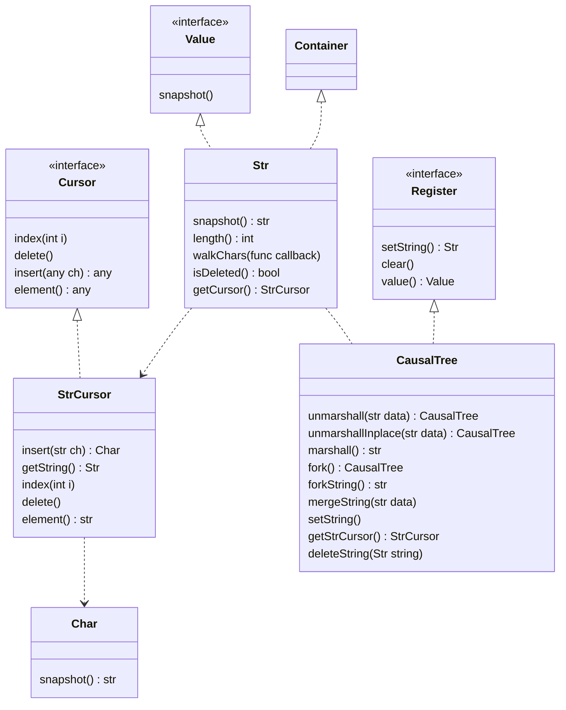
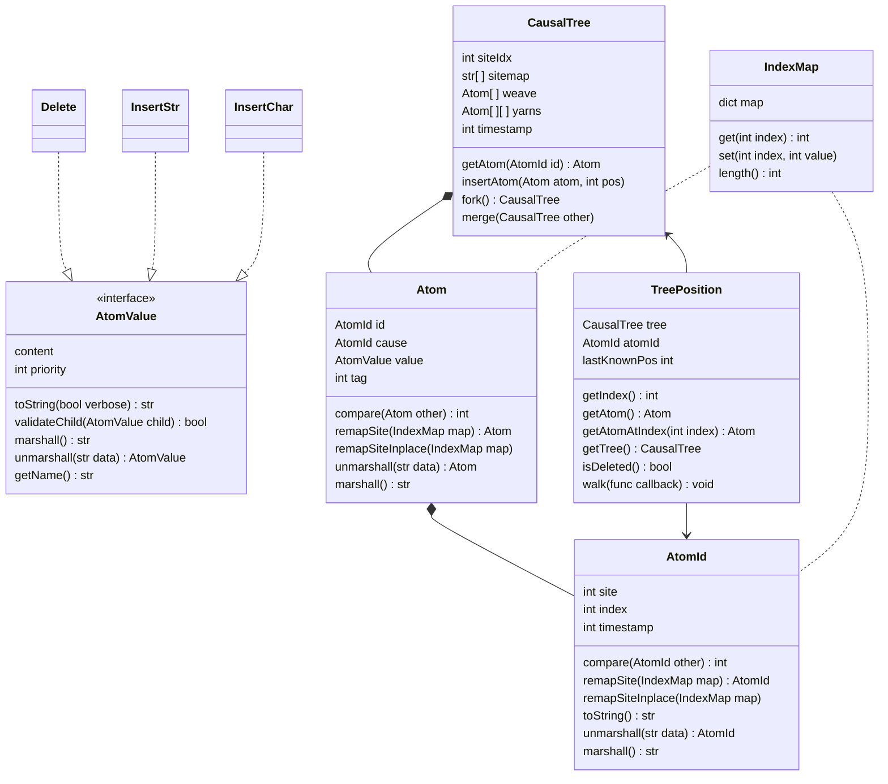

# Causal Tree RDT

Implementation of a causal tree replicated data type (RDT) in Typescript.

## Requirements

- Node.js 16 (or higher)
- yarn

If you don't have any Node version installed, we recommend following [this tutorial](https://docs.npmjs.com/downloading-and-installing-node-js-and-npm) (with nvm). You can install the latest stable yarnV1 version.

## Installation

To install any needed dependencies, simply run

```bash
yarn install --frozen-lockfile
```

## Usage

While in development, you can run the application in live mode using the following command:

```bash
yarn dev
```

In this way, it will recompile as you change source files.

To run the application as in production, you need first to compile source files to Javascript using:

```bash
yarn build
```

This will create the `build` directory at root (if it doesn't exist). Then, you can run:

```bash
yarn start
```

To check the code for any style issue or bad practice, you can run:

```bash
yarn lint
```

Which runs ESLint linter with the provided rules. To fix any auto-fixable issue, you can run:

```bash
yarn lint:fix
```

We provided some test files that can be executed with:

```bash
yarn test
```

Or, to generate a coverage report:

```bash
yarn test:coverage
```

## Diagrams

### Interface structure and relations



### Core structure


